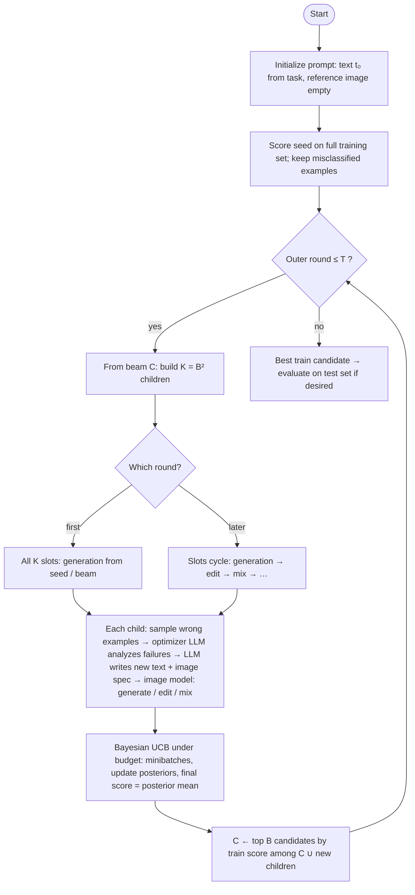
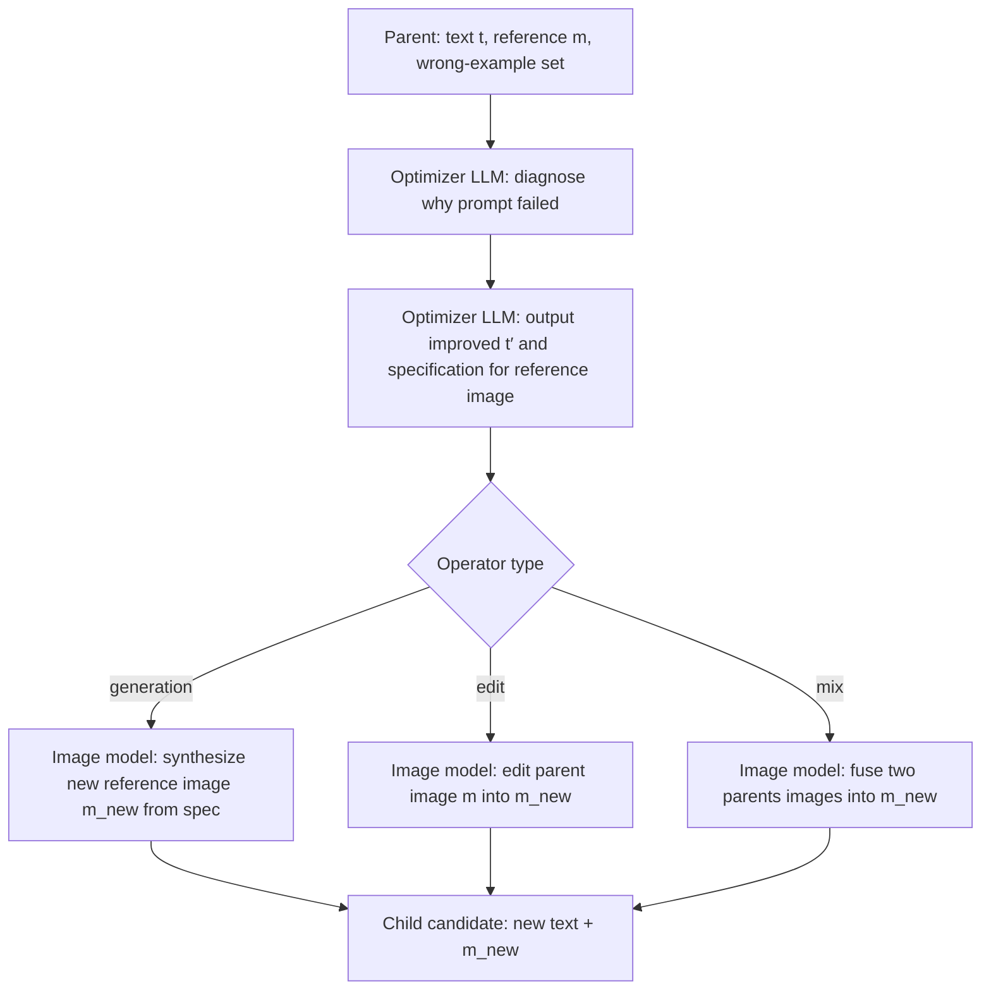
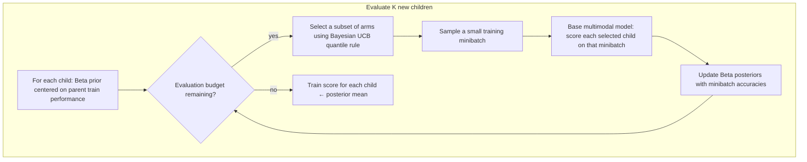

# MPO: Algorithmic View

This document describes **what the Multimodal Prompt Optimizer (MPO) is doing as an algorithm**, using the same structure as this repository’s implementation but **without** file names, APIs, or logging details. For wiring and code paths, see `MPO_RUNTIME_FLOW.md`.

---

## 1. Problem and objective

- **Task:** A fixed supervised task (e.g. image classification from a query image). The learner is a **multimodal model** that answers given a **user message** built from prompts and the instance.
- **What is optimized:** A **multimodal prompt** — a pair **(t, m)** where:
  - **t** is a **text instruction** (what the model should do).
  - **m** is an optional **reference image** (a “visual prompt” shown alongside the instruction). The algorithm may start with **m = ∅** (text only).
- **Goal:** Find **(t, m)** that **maximizes accuracy** (or the task’s scalar metric) on **training** data, then report performance on **held-out** data using the best candidate found.

So MPO is **search in a joint space** over **text and image**, not text alone.

---

## Overview diagrams

### End-to-end search loop

High-level control flow: **beam search** over **(text, reference image)** with **K = B²** proposals per round and **budgeted** scoring.

### One proposal child (generation, edit, or mix)

The three operators share the same **LLM reasoning** path; only the **image step** differs.

### Inner loop: scoring K children with Bayesian UCB

Replaces exhaustive full-dataset scoring for every child with **sequential** allocation of **training-example** evaluations.

---

## 2. Scoring a single candidate

Given a candidate **(t, m)** and a set of labeled examples **S**:

1. For each example, build the model input: optional reference **m**, task-specific query, and the **target** image (or other modality) to classify.
2. Run the **base multimodal model** and parse its answer.
3. **Score** = fraction of examples in **S** answered correctly (or the task’s equivalent aggregate).

The algorithm uses **full training set** scoring **once** for the **initial** prompt, and **budgeted, sampled** scoring for **proposed** children (Section 6).

---

## 3. Beam and outer loop

**Hyperparameters:**

- **B** — beam width (keep **B** best candidates).
- **T** — total number of **outer rounds** of expansion (including the first round, which uses only **generation** proposals).
- Each round proposes **K = B²** new candidates **before** merging into the beam.

**State:** A beam **C** of at most **B** candidates, each with a **train score** (and stored errors for proposal).

**Initialization:**

1. Start from a **task-defined** initial text **t₀** and **no** reference image (**m₀ = ∅**).
2. Score **(t₀, m₀)** on **all** training examples. Store **misclassified** examples for later steps.

**Outer loop (repeat for T rounds):**

1. Using the current beam **C**, produce **K** **child** candidates with the **proposal operators** (Section 4). Operators may run in parallel; each child has one or two **parents** from **C**.
2. **Evaluate** all **K** children with a **fixed evaluation budget** (Section 6). Each child receives a **train score estimate**.
3. **Beam update:** Let **C′ = C ∪ {new children}**. Sort **C′** by **train score** (descending) and keep only the **top B** as the new **C**.

After **T** rounds, the **best** candidate in the final beam (by train score) is the primary output for reporting **test** performance (in the default setting, only that candidate is evaluated on the test set).

---

## 4. Proposal operators (how children are built)

Each child is created by applying one of three operators to parent candidate(s) in the beam. The operator type is fixed **per slot** in the batch of **K** proposals:

- **Round 1:** all **K** slots use **generation** from the **same** current best seed (initially the root only).
- **Later rounds:** slots cycle **generation → edit → mix → generation → …** over the **K** positions.

Parents are chosen from the current beam **C**:

- **Generation** and **edit:** one parent **p** drawn **uniformly** from **C**.
- **Mix:** two **distinct** parents **p₁, p₂** drawn **without replacement** with probability **proportional to their train scores** (better prompts are more likely to be parents).

### 4.1 Shared subroutine: failure-driven text + image update

For each parent **p**, the builder uses:

1. A small set of **misclassified training examples** for **p** (capped at a fixed count **M**).
2. A **strong optimizer model** (LLM) that sees **p**’s text **t**, **p**’s reference image **m** (if any), and those **failure cases** (input, model output, ground truth).
3. **Step A — Analysis:** The LLM produces a **diagnosis** of why the multimodal prompt failed.
4. **Step B — Rewrite:** The LLM outputs an **improved text instruction** and a **specification** for how the **reference image** should change.

Then a **multimodal generator** (e.g. image model) realizes the image part:

| Operator   | Effect on the reference image **m** |
|-----------|----------------------------------------|
| **Generation** | Create a **new** image from the specification (no previous image required, though the parent image may inform the LLM). |
| **Edit**         | **Edit** the parent’s current reference image according to the specification. |
| **Mix**          | **Combine** the two parents’ reference images according to a **fusion** specification from the LLM (cross-prompt mixing). |

The **child** is **(t_new, m_new)** with **parent link(s)** recorded for priors in evaluation.

---

## 5. Action schedule in one outer round

For **K = B²**:

- **Slot i** (0-based) uses operator **generation** if **i mod 3 = 0**, **edit** if **i mod 3 = 1**, **mix** if **i mod 3 = 2** (after the first round).

So each round explores **three modes** of changing the visual prompt: **from scratch**, **local edit**, and **cross-breeding** two beams.

---

## 6. Evaluating many children under a budget (Bayesian UCB)

When **K** new children appear, scoring all of them on the **full** training set may be too expensive. The implementation uses **sequential allocation** inspired by **multi-armed bandits**:

- **Total budget** scales like **(budget per candidate) × K** — e.g. a cap on how many **training-example evaluations** (base-model forward passes) to spend **across** the **K** arms in this round.
- **Per step:** sample a **small minibatch** of training examples (disjoint sampling until the pool is exhausted, then reset).
- **Subset of arms:** each step evaluates only a **subset** of the **K** children on that minibatch (default: 3 at a time), **chosen** to balance **exploitation** (promising scores) and **exploration** (uncertainty).

**Bayesian UCB variant used here:**

- Each child starts with a **Beta prior** on its success probability, **centered** on the **parents’** observed train performance (two parents averaged for **mix**; neutral center if no parent signal).
- After each minibatch, update the Beta **posterior** using the **minibatch accuracy** as a **fractional** success/failure count.
- The **selection rule** picks arms with high **upper credible bounds** (quantiles of the Beta posterior), with exploration pressure that **decreases** as the inner round index grows.
- **Final train score** for ranking is the **posterior mean** (expected accuracy under the Beta model).

After this subroutine, each of the **K** children has a **train_metric**; the beam update (Section 3) uses these values.

---

## 7. What MPO is doing in one sentence

**MPO** maintains a **small beam** of **(text, reference-image)** prompts, and each round **spawns many children** by **diagnosing failures** with an LLM and **regenerating or editing** the visual prompt, then **efficiently scores** those children with **Bayesian UCB** on **sampled** training data before **pruning** back to the best **B** prompts — repeating for **T** rounds to **jointly** improve **text and image** sides of the prompt.

---

## 8. Parameters (conceptual)

| Symbol | Meaning |
|--------|--------|
| **B** | Beam width |
| **K = B²** | Proposals per outer round |
| **T** | Number of outer rounds |
| **M** | Wrong examples shown to the optimizer LLM per proposal |
| Budget | Train evaluations per child per round (drives inner bandit length) |
| Priors | Strength of belief pulled toward parent performance (Bayesian UCB) |

Exact minibatch sizes and inner-round counts follow from the chosen **budget**, **K**, and how many arms are evaluated per inner step; the **algorithmic** idea is **bandit allocation**, not full training-set scoring for every child.
