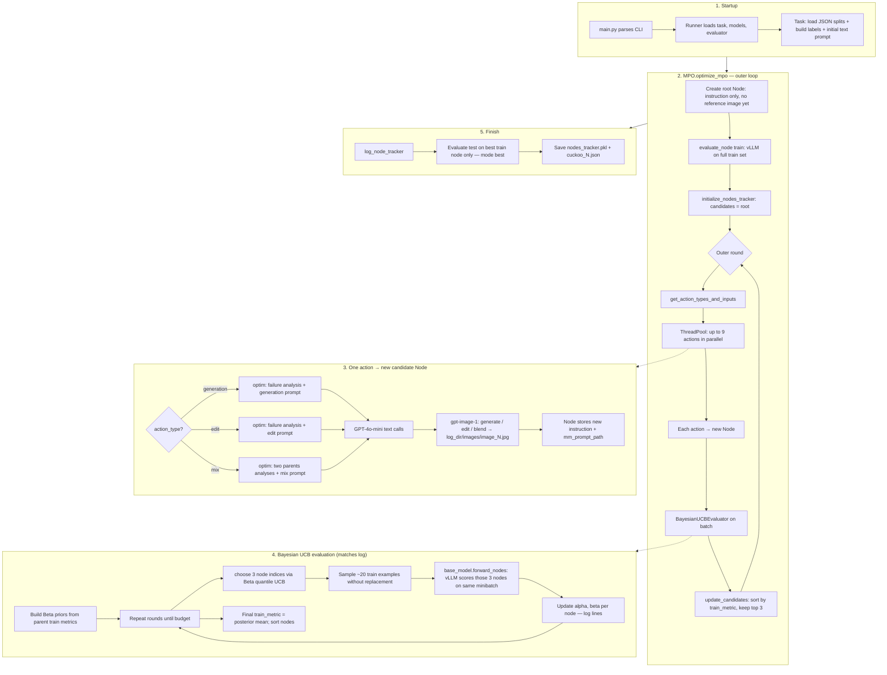

# How MPO Runs in This Codebase (Implementation View)

This note matches **this repository’s code** and what shows up in **`log.log`** (e.g. `Action Types`, `[BayesianUCB]`, blocks of `================================================================================` with GPT prompts/responses, and new files under `images/image_*.jpg`). It is not a restatement of the paper alone.

---

## Flow diagram (code + logs)

---

## Step-by-step (what each part does)

### 1. Startup (`main.py` → `Runner`)

- **`main.py`** parses arguments (`--task_name`, `--data_dir`, `--base_model_port`, `--evaluation_method bayes-ucb`, etc.) and reads API keys from the environment.
- **`Runner.__init__`** (`src/runner.py`):
  - Builds **`task_setting`** and instantiates the task via **`get_task`** (for `cuckoo`, that resolves to **`CUB`** in `src/tasks/__init__.py`).
  - Creates **`BaseModel`**: resolves **`Qwen2.5-VL-7B`** to the **vLLM** client (`src/model/vllm.py`) talking to `http://localhost:<port>/v1`.
  - Creates **`OptimizationModel`** with **`gpt-4o-mini`** and an **`MMGenerator`** (**`gpt-image`** → OpenAI **image** API, `gpt-image-1`).
  - Creates **`BayesianUCBEvaluator`** when `--evaluation_method bayes-ucb` (your logs show `[BayesianUCB] Prior strength: 10.0, c=2.0`).
- **`Runner.run`** calls **`self.search_algorithm.train()`** → for method `mpo`, that is **`MPO.optimize_mpo`** (`src/search/mpo.py`).

### 2. Task and root node

- **`CUB`** (`src/tasks/cub.py`) loads **`{task}_train.json`** / **`{task}_test.json`** under **`{data_dir}/classification/cub/`** and builds **`labels`** from the test split.
- The **initial text instruction** for classification comes from **`Classification.get_initial_prompt`**: *“Given the image, answer the following question.”* (`src/tasks/classification.py`). The **root `Node`** has **no `mm_prompt_path`** yet, so the base model’s first forward pass uses **only** that text plus each training **query image** (see **`BaseModel._build_forward_prompts_completion`** — the reference image block is skipped when `mm_prompt_path` is missing).

### 3. First evaluation of the root (train only)

- **`evaluate_node(node, split="train")`** (`src/search/base_search.py`) runs **`base_model.forward`** on **all** training examples.
- **`forward`** builds one chat-style prompt per example: optional **reference image** (multimodal “prompt”), then **`task.get_query`** (for CUB: classify target image with **Choices: [labels]**), then the **target image** path.
- **vLLM** returns answers; the task **parses** **`model_answer`**, sets **`correct`**, and **`cal_metric`** is **mean accuracy** on that batch (`src/tasks/base_task.py`).
- The node stores **`train_metric`**, **`model_wrong_examples`**, and **`model_correct_examples`** for later **failure-driven** optimization.

### 4. Outer search loop (`MPO.optimize_mpo`)

Parameters from your **`main.sh`**: **`beam_width=3`**, **`iteration=13`**, so **beam_width² = 9** child proposals per outer round.

- **Round with `it == -1` (first expansion)**  
  - **`get_action_types_and_inputs`** sets **nine `"generation"`** actions, each taking the **same** current candidate (the root).  
  - Your log line matches this:  
    `Action Types: ['generation', 'generation', ...]` (nine times).

- **Later rounds (`it` in `0 .. iteration-2`)**  
  - Nine actions cycle **`generation` → `edit` → `mix`** (`OPERATOR_CHOICES` in `mpo.py`).  
  - Log:  
    `Action Types: ['generation', 'edit', 'mix', 'generation', 'edit', 'mix', ...]`.
  - **`generation` / `edit`**: parent is **one** node sampled uniformly from the current **beam** (top 3 by train metric).
  - **`mix`**: **two distinct** parents sampled with probability **proportional to `train_metric`** (normalized), so better prompts are more likely to be parents for mixing.

- **`_generate_nodes_parallel_pairs`** runs up to **`max_workers=10`** threads; each thread calls **`action(inputs, action_type)`**, which calls **`optim_model.mpo_optim_*`** and returns a **new `Node`**.

- **`update_candidates`**: all **new** nodes are appended to **`candidates`**, sorted by **`train_metric` descending**, then **truncated to `beam_width` (3)**. So each round you keep only the **three strongest** candidates for the next round’s sampling.

**Iteration count in code:** one block runs with **`it=-1`**, then **`for it in range(self.iteration - 1)`** runs **`iteration - 1`** more times. With **`iteration=13`**, you get **1 + 12 = 13** outer rounds of “generate 9 nodes → evaluate → prune to 3”.

### 5. What one optimization action does (`OptimizationModel` + `MMGenerator`)

This is what produces **long GPT-4o-mini log sections** and **`images/image_*.jpg`**.

1. **`node.get_wrong_examples(model_responses_num)`** — up to **`model_responses_num`** (e.g. 3) **misclassified** training examples from that node.
2. **`mpo_failure_analysis`** — builds a **“Prompt Failure Analysis Agent”** prompt (`get_multimodal_analysis_prompt` in `src/optim_model.py`) with current **text + reference image (if any) + wrong examples**, and calls **`self.model.generate`** (**GPT-4o-mini**).
3. Depending on **`action_type`**:
   - **Generation**: **`get_multimodal_generation_prompt`** → model outputs **`<image_generation_prompt>...</image_generation_prompt>`** and **`<improved_text_prompt>...</improved_text_prompt>`**; parsed by **`_clean_response`**.
   - **Edit**: **`get_multimodal_edit_prompt`** → **`<image_edit_prompt>`** + improved text.
   - **Mix**: **`get_multimodal_improvement_mix_prompt`** with **two** parents → mixed text + **`<image_mixing_prompt>`** (see same file).
4. **`generate_mm` / `edit_mm` / `mix_mm`** call **`OpenAIImageGenerator`** (`src/model/mmgenerator.py`):
   - **Generate**: `images.generate` → **base64** saved as **`{log_dir}/images/image_{n}.jpg`**.
   - **Edit / mix**: `images.edit` with one or two **parent image files**.
5. **`log_information`** writes the **80-equals** separators and **full prompt text + model response** — the blocks you see in **`log.log`**.

So: **GPT-4o-mini** proposes **text + instructions for the image side**; **gpt-image** materializes the **reference image** stored on disk and referenced by **`Node.mm_prompt_path`**.

### 6. Evaluating a batch of new nodes (`BayesianUCBEvaluator`)

When logs say **`[BayesianUCB] Starting evaluation with 9 nodes`**, the evaluator is scoring the **nine** new children **before** beam pruning (the list passed in is the **batch** for that round; after evaluation, **`update_candidates`** merges and keeps top 3).

- **`eval_budget = budget_per_prompt * len(nodes_list)`** — with **`budget_per_prompt=100`** and **9** nodes, **900** “evaluation credits” drive the inner loop.
- **`samples_per_eval = budget_per_prompt // 5`** → **20** training examples per minibatch (for budget 100).
- **`num_prompts_per_round`** defaults to **3**: each inner round picks **3** nodes to evaluate on that minibatch.
- **Priors** (`_build_beta_priors`): for each new node, **`p0`** is the **mean of parents’ `train_metric`**, or **0.5** if no parents; then **Beta priors** are built with **`prior_strength`** derived from **`bayes_prior_strength`** and **`budget_per_prompt`** (your log: **`alpha0=[4.33...] beta0=[7.67...]`**).
- **`choose`**: Bayesian UCB using a **high quantile of the Beta posterior** (exploration decreases as round index **`t`** grows).
- **`forward_nodes`**: for the **same 20 examples**, run **vLLM** once per (example × selected node) batching — effectively comparing prompts on **identical** data for that step.
- **`update`**: treats each node’s observed **minibatch accuracy** as a **fractional** success/failure count to update **`alpha` / `beta`** (see `evaluators.py`).
- After all inner rounds: **`train_metric`** on each node is set to the **posterior mean** **`alpha/(alpha+beta)`**, nodes are **sorted** descending.

Log lines like **`[BayesianUCB] Sampled nodes: [8 7 6]`** and the following **`alpha`, `beta`** dumps correspond to this inner loop.

### 7. After the last outer round (`log_node_tracker`)

- **`evaluate_test_nodes`** with **`test_metric_evaluation_mode="best"`** (default in `main.py`): only **`nodes_tracker["updated"][-1][0]`** — the **top train-metric node after the final prune** — is run on **test** (`base_search.py`).
- Saves **`nodes_tracker.pkl`**, writes **`cuckoo_{version}.json`** with **train/test best** summaries and node metadata.

---

## Quick mapping: log phrase → code

| Log / artifact | Where it comes from |
|----------------|---------------------|
| `Action Types: [...]` | `MPO.get_action_types_and_inputs` (`src/search/mpo.py`) |
| `[BayesianUCB] ...` | `BayesianUCBEvaluator.__call__` (`src/evaluators.py`) |
| `--------------- Model Output ---------------` | `forward_log_template` in `base_model.py` |
| Long `====` + prompt + response | `OptimizationModel.log_information` (`optim_model.py`) |
| `OPENAI IMAGE GENERATION COST` | `OpenAIImageGenerator` (`mmgenerator.py`) |
| `images/image_N.jpg` | `save_b64_image` under **`logger.log_dir/images`** |
| `Evaluating 9 nodes (Bayes-UCB)` | `tqdm` in `BayesianUCBEvaluator` |

---

## Models involved (your setup)

| Role | Typical model | Protocol |
|------|----------------|----------|
| **Base / evaluator** | Qwen2.5-VL (local) | OpenAI-compatible **vLLM** HTTP |
| **Optimizer (text)** | gpt-4o-mini | OpenAI Chat Completions |
| **Multimodal prompt (image)** | gpt-image-1 | OpenAI Images **generate** / **edit** |

This split is why the run **hits the GPU** heavily for classification while also **incurring OpenAI image + chat** costs logged in **`log.log`**.
